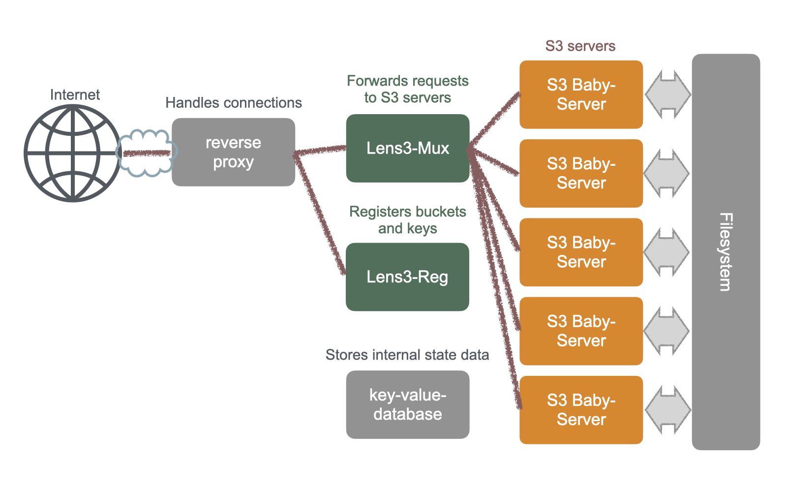

.. fugaku-s3-service-guide documentation master file.

===========================
Fugaku AWS S3 Service Guide
===========================

This AWS S3 service on Fugaku allows users to share files in Fugaku's
filesystem.  An S3 server will be started as a user's process when
configured buckets are accessed.  Users first need to register the
path to a directory in the filesystem to share.  Then users can create
buckets and access keys.

This user guide briefly describes usage of the S3 service on Fugaku.
For questions, asking in *Zendesk Community* is a quickest way to
contact maintainers of the service.

.. toctree::
   :maxdepth: 2
   :caption: Contents:

.. * :ref:`genindex`
.. * :ref:`modindex`
.. * :ref:`search`

An Overview of the Service
==========================

This service, Lenticularis-S3 (Lens3), consists of two open-source
software, Lens3 + Baby-server.  Lens3 is a multiplexer to provide a
single access point for multiple servers.  Baby-server is a small AWS
S3 server.  Lens3 forwards access requests to one of the servers with
regard to bucket's owner.

Lens3 does not provide buckets operations, such as listing or creating
buckets.  Bucket creation is obviously prohibited because Lens3
delivers requests with regard to a bucket (which does not exist yet).

Thus, bucket creation should be performed in advance.  The Web-UI is
used to create buckets.  In Lens3's terminology, a *pool* refers to a
directory in the filesystem where buckets are created.  Users first
create a pool, then create buckets in it.

Registering Buckets
===================

Lens3 Registrar can be accessed by the following URL.  It is a service
to register a pool and create buckets and access keys.

https://lens3.fugaku.r-ccs.riken.jp/lens3.sts/

The Lens3's page in github.com has a good guide of the steps to create
buckets.  Please refer to it.  Bucket names are global, that is, they
are shared by all users.  Please avoid short commonplace names.

https://github.com/RIKEN-RCCS/lens3/blob/main/v2/doc/user-guide.md

Accessing Buckets by AWS CLI
============================

The access point (``endpoint_url``) of the S3 service is:

    https://lens3.fugaku.r-ccs.riken.jp

There are many AWS S3 client software and choose one for your liking.
AWS CLI is a popular one.  We use AWS CLI in the following.

AWS CLI Installation
--------------------

An installation instruction of AWS CLI can be found in the following
page.

* https://docs.aws.amazon.com/cli/latest/userguide/getting-started-install.html

The config file "~/.aws/config" may contain the following lines.  The
credentials (access keys) can be created and copied in the Web-UI.
Usually, only the lines of a pair of credentials are suffice.  Note
the credentials can be stored in a separate file
"~/.aws/credentials". ::

    [default]
    s3 =
        signature_version = s3v4
        addressing_style = path
    ec2_metadata_disabled = true
    endpoint_url = https://lens3.fugaku.r-ccs.riken.jp
    aws_access_key_id = WoRKvRhrdaMNSlkZcJCB
    aws_secret_access_key = DzZv57R8wBIuVZdtAkE1uK1HoebLPMzKM6obA4IDqOhaLIBf

S3 Operation -- Listing files
-----------------------------

Try a simple command::

    aws s3 ls s3://some-bucket-name/

Replace *some-bucket-name* with an actual one, as usual.

Optionally ``aws`` command accepts an option
``--endpoint-url=https://lens3.fugaku.r-ccs.riken.jp`` which replaces the
"endpoint_url" in "~/.aws/config".

S3 Operation -- Uploading files
-------------------------------

Then, try a command::

    aws s3 cp sample.txt s3://some-bucket-name/

S3 Operation -- Downloading files
---------------------------------

Or, try another command::

    aws s3 cp s3://some-bucket-name/sample.txt

Notes
=====

.. note::

    Access keys have expiration.  The lifetime of access keys is
    limited to 180 days in the current setting.  It will fail to try
    to create a key with longer lifetime.

    The service is limited to 30 servers at a time (the number of
    pools simultaneously accessed).  It will be upgraded to a more
    powerful host when the service will become extensively used.

Software Components
===================

* Lens3: Multiplexer
    * https://github.com/RIKEN-RCCS/lens3
* S3 Baby-server: Small AWS S3 Server
    * https://github.com/RIKEN-RCCS/s3-baby-server
